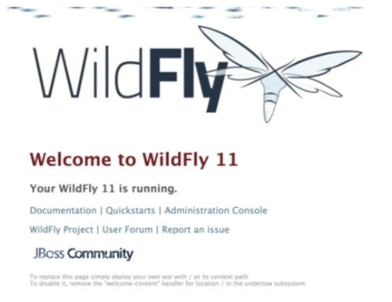

This series will cover some aspects of the Java EE specification, both in theory and practice. Theory articles, generally marked as introduction, aim at providing theoretical background. Practice articles then aim at exploring the code examples and HOW TO’s. I consider the requirements Red Hat’s Enterprise Application Developer Exam (EX183) as a basic reference of requirements for beginner developers when it comes to Java EE, though I may cover some topics more in-depth and other topics less so.

# Prerequisites

1. Basic Java understanding
2. Installed Application Server 
3. Installed Maven
4. Java IDE

## 1. Basic Java understanding

I expect you understand basic Java code, including objects, classes, loops, packages, methods and parameters, etc. If you are completely new to the field of programming and need to learn JEE for whatever reason (hello there, new tech writers), I’d recommend starting out with some basic Java SE courses, and working your way to this blog. I personally recommend the following:

* [Java Programming and Software Engineering Fundamentals Specialization](https://www.coursera.org/specializations/java-programming)
* [Object Oriented Programming in Java Specialization](https://www.coursera.org/specializations/object-oriented-programming)
* [Object Oriented Java Programming: Data Structures and Beyond Specialization](https://www.coursera.org/specializations/java-object-oriented)

All of the resources above are free to audit, and are in order of increasing difficulty. Going through the training will grant any beginner the necessary basics and confidence to follow my articles on the Java EE specification.

## 2. Installed application server

Java EE requires a server on which you can deploy your applications. In my articles, I will be using Wildfly. It is free, OpenSource, and it is also enjoying heavy contribution coming from Red Hat.
To install Wildfly:

1. Visit the Wildfly (download page)[https://wildfly.org/downloads/] and download the latest Wildfly version. Select the one with full JEE profile, for example: `Java EE7 Full & Web Distribution` or `Application Server Distribution`. 
2. Unzip the archive into location of your choice, for example `C:\wildfly`, or `~/wildfly`. You have successfully installed Wildfly. 

To start the server:
1. Open your command line and change to the directory where you unzipped the server, for example cd `c:\wildfly`.
2. Execute the start script, for example: `wildfly-12.0.0.Final\bin\standalone.bat` on Windows or `wildfly-12.0.0.Final/bin/standalone.sh` on Unix systems (Linux and Mac OS X).
3. Wait until you see successful start message:

```shell
16:04:54,836 INFO  [org.wildfly.extension.undertow] (MSC service thread 1-4) WFLYUT0006: Undertow HTTPS listener https listening on 127.0.0.1:8443
16:04:54,899 INFO  [org.jboss.ws.common.management] (MSC service thread 1-2) JBWS022052: Starting JBossWS 5.3.0.Final (Apache CXF 3.3.2)
16:04:54,995 INFO  [org.jboss.as.server] (Controller Boot Thread) WFLYSRV0212: Resuming server
16:04:54,997 INFO  [org.jboss.as] (Controller Boot Thread) WFLYSRV0060: Http management interface listening on http://127.0.0.1:9990/management
16:04:54,998 INFO  [org.jboss.as] (Controller Boot Thread) WFLYSRV0051: Admin console listening on http://127.0.0.1:9990
16:04:54,998 INFO  [org.jboss.as] (Controller Boot Thread) WFLYSRV0025: WildFly Full 17.0.0.Beta1 (WildFly Core 9.0.0.Beta6) started in 3341ms - Started 313 of 576 services (366 services are lazy, passive or on-demand)
```

At this point, you can open http://127.0.0.1:8080 in your browser. You should see a welcome screen:




You can stop your server by pressing `ctrl+c` in the command line. Note that on Windows, if the logs look successful but you cannot access http://127.0.0.1:8080, you may need to adjust your firewall settings.

## 3. Installed Maven

Maven is, amongst other things, a Java dependency management tool. Follow the official installation guide to install it. When you issue `mvn -v` in the command line, you should get a valid output, such as:

```shell
Apache Maven 3.5.2 (138edd61fd100ec658bfa2d307c43b76940a5d7d; 2017-10-18T09:58:13+02:00)
Maven home: /Users/marek/apache-maven-3.5.2
Java version: 10.0.1, vendor: Oracle Corporation
Java home: /Library/Java/JavaVirtualMachines/jdk-10.0.1.jdk/Contents/Home
Default locale: en_CZ, platform encoding: UTF-8
OS name: "mac os x", version: "10.14.4", arch: "x86_64", family: "mac"
```

You do not need to know a lot about Maven, because it’s one of the things you will get familiar with if you follow my articles. However, at this point, you need to install it.

## 4. Java IDE

While you probably already have an IDE, I recommend you download plugins that provide support for JEE. An easy way to achieve full JEE support is to install the JBoss Developer Studio, which is free for developers, and contains a number of plugins that make your JEE development life easier. In the end, it does not matter a lot what IDE you use, but I thought JBDS worth mentioning.
You are now set to browse through the JEE course. Feel free to browse the EX183 or JavaEE tags.