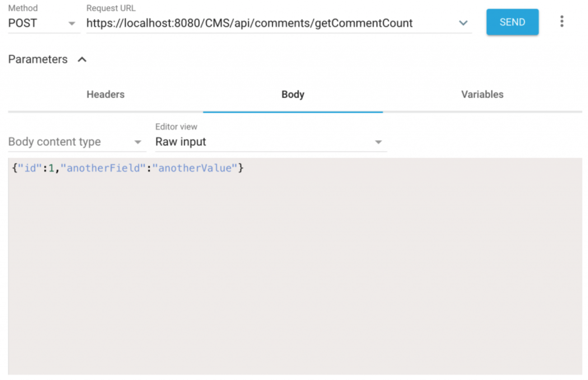

# Introduction

The acronym _REST_ stands for REpresentational State Transfer. Still not much clearer, huh? Creating a REST service is a way to expose certain methods of your application such that they can be invoked over the internet. This is generally done when you need to decouple your application backend from the application frontend. For example, you may want to:

* Create UI independent of the application
* Create a mobile app that interacts with the backend only and has its own UI 
* Let other developers integrate your backend with their application

All of the above points are very easily and efficiently achieved via a REST service. Any REST service is, by definition:

* Stateless
* Cacheable
* Self-descriptive (if written correctly)
* Bi-directional (client sends a request, server sends a response) Utilizing http(s) protocols as the medium of communication

In the Java EE world, the specification we will focus on that describes methods, annotations, and ways of interacting with REST services is JAX-RS. In our articles, we use the JBoss implementation RESTEasy, though you could use many others (such as Jersey).

# Creating RESTful web services

Consider a situation where you are creating a content-management system in Java. You have implemented your classes and methods and everything works though you have no graphical representation of your data. Naturally, you now want to display it in a nice, concise manner. Let’s say you want to look up how many comments does any given article have at the time of accessing the article. Your method may look something like this:

```java
public int getNumberOfComments(long id) {
```

If you want to expose this method so that your JavaScript interface can call it, define the following:

1. Application path: the path for all the REST requests in your application 
2. Path to the method (REST endpoint)
3. Parameters used with the method (in our example, the id parameter).

## Creating the application path

The application path will serve as an entry point for all your REST calls within your application. It is defined using:

* *@ApplicationPath* annotation
* Extending the *javax.ws.rs.core.Application* class

For example:

```java
import javax.ws.rs.ApplicationPath;
import javax.ws.rs.core.Application;

@ApplicationPath("api")
public class RestApplication extends Application { 
    // This class is empty, nothing is omitted
}
```

In the example above, if our application has context path of `CMS`, which means the application is accessible on `localhost:8080/CMS`, our REST endpoints would be accessible on `localhost:8080/CMS/api`. 

This class can be in any package in your application, and it is required if you want to expose REST API endpoinds.

## Creating the REST endpoint

At this point, you have enabled REST API for your application, and you can annotate your methods to turn it into a REST endpoint (i.e. expose it over HTTP) and make your application RESTFul:

```java
import javax.ws.rs.GET;
import javax.ws.rs.Path;
import javax.ws.rs.PathParam;
import javax.ws.rs.Produces;
import javax.ws.rs.core.MediaType; 

@Path("/comments")
@Stateless
public class CommentsRESTService {
  @GET
  @Path("/getCommentCount/{id}")
  @Produces(MediaType.APPLICATION_JSON)
  public int getNumberOfComments(@PathParam("id") long id) { 
    return commentService.getCommentsFor(id);
  }
}
```

Notice the following:

1. There are two paths:
    1. At the class level, valid for all methods within the class 
    2. At the method level, specifying the precise URI
2. The class is _Stateless_. If your RESTful class is either a managed bean or an EJB bean, it cannot be a stateful since there is no state between requests. Why is it an EJB? You probably won’t run a CMS without a database, that means JPA. And in JPA, you either take care of transactionality, or you make it an EJB and then, the container, i.e. the application server, takes care of committing transactions to the database, or rolling it back when something goes wrong.
3. We can very easily switch produced return value using the *Produces* annotation
4. The path param is marked in two places; in path (where it is given a name) and in the argument of the method (where it is tied to the parameter by its name).

Extending previous example where the application context is `/CMS` and the application path is/api, the full path is `localhost:8080/CMS/api/comments/getCommentCount/1`, where 1 will be used as the input parameter for our method.

## REST endpoint parameters and payloads

There are three ways of passing parameters to your REST endpoint:

1. Path parameter; e.g. `localhost:8080/CMS/api/comments/getCommentCount/1` 
2. Query parameter; e.g. `localhost:8080/CMS/api/comments/getCommentCount?id=1`
3. Payload; not visible in the URL request

We saw path parameter in our previous example. Query parameter would then be implemented in the same example as such:

```java
@GET
@Path("/getCommentCount")
@Produces(MediaType.APPLICATION_JSON)
public int getNumberOfComments(@QueryParam("id") long id) {
  return commentService.getCommentsFor(id);
}
```

Payload is then used for when you are passing custom objects to your methods. For example, if our method accepted the *Article* object, we could pass something like:

```json
{"id":1, "anotherField" : "anotherValue"}
```

You can send payloads from the command line (I like to use curl), but there are a number of browser extensions that will make your life much easier (for example, the Advanced REST Client for google chrome):



# REST endpoint verbs

RESTful endpoints use a number of HTTP protocol verbs:

* **GET**:Returns a piece of data based on input parameters. GET calls are idempotent, i.e. calling the same endpoint multiple times should always produce the same result (for example, you always get a response 200 and a number in the payload)
* **PUT**: Is used when you update an object regardless of its old state. So when you change object with ID 1 to become your new object that you pass as the payload, that would we a PUT method
* **DELETE**: Is used for deleting your resource or entity.
* **POST**: Is used for anything else; often, its use is for creation of an entity that did not previously exist

All of the above verbs have their annotations, for example `@GET` as we’ve seen earlier.

# HTTP status codes

The EX183 exam dictates that the developer should know HTTP status codes. This is quite a large topic. If you want to learn it in depth,see the [HTTP response status codes page](https://developer.mozilla.org/en-US/docs/Web/HTTP/Status). As a quick summary, I think the following codes are worth mentioning:

* **200** OK – request successful
* **201** Created – for example when your POST request has created an entity
* **204** No content – for example, when you create an entity and it is successfully saved into the database
* **400** Bad Request – possibly malformed query parameter, or URL
* **401** Unauthorized – incorrect credentials (e.g. username:password)
* **403** Forbidden – insufficient permissions of the credentials (or wrong URI).
* **500** Internal Server Error – something went wrong on the server side (e.g. an application exception)

I feel those are the most common return codes I’ve encountered. The application server, in general, manages the return codes in HTTP responses for you.

# Consuming JAX-RS services

In the REST section of the EX183 exam, you can see the requirement for consuming Rest services as well. I feel it is most likely that you will be consuming REST services from other languages, such as Python or JavaScript, that render frontend. In case you want to consume the services from Java, Java EE also includes a handy API for that. For more details, see:

* The official Red Hat JBoss EAP (enterprise-grade application server based off of Wildfly) documentation on the JAX-RS client
* The practical example where we use the JavaEE client for testing. At the time of writing, the example may be quite small; as is usual, I plan on releasing the practical as a separate article.

# Summary

This article has been an introduction into the world of RESTful applications. By now, you should be able to describe:

* What is a REST service and when could you use it
* What are the basic HTTP verbs that it uses and for what purposes How do you pass a variable to your REST endpoint
* How do you create application path for all your rest endpoints
